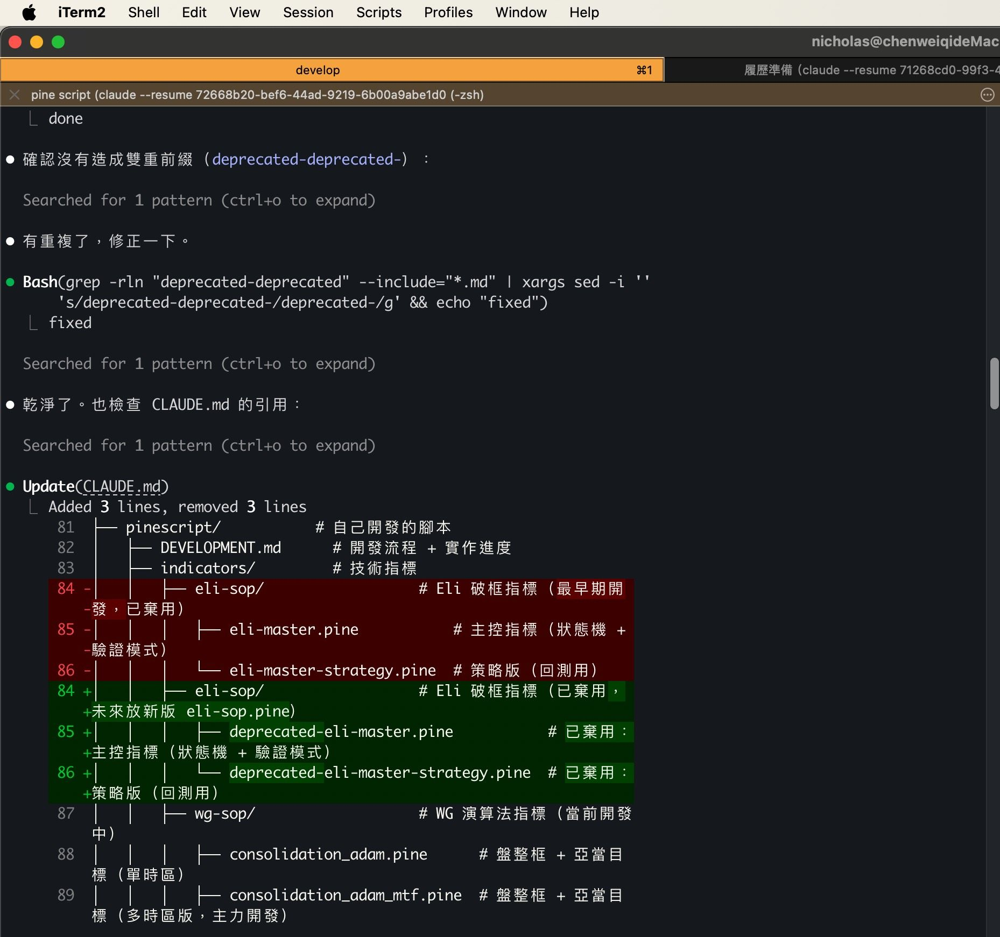
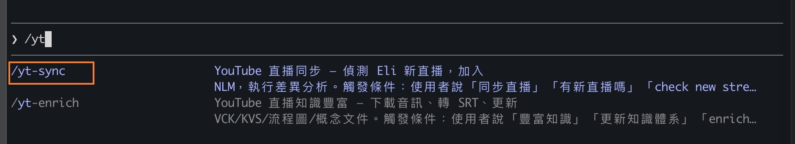
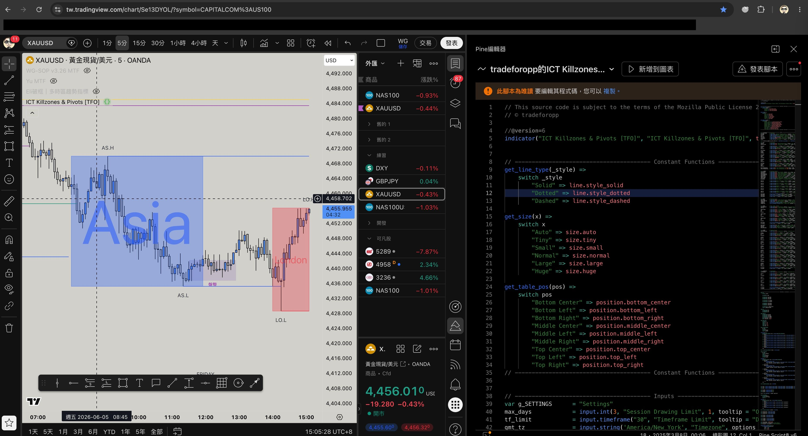
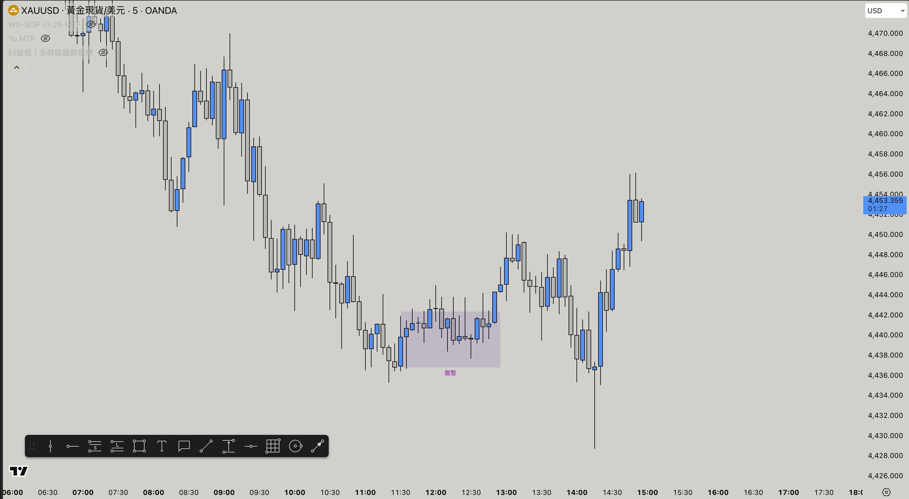

# Experience

這邊會分享我開始用 AI 學習與寫程式的經歷
1. **Trading**: 我個人學習交易的專案
2. **Eagle**：把 [飛鷹地產](https://www.eagle111.com/) 的後端，從 [ASP.NET](https://dotnet.microsoft.com/en-us/apps/aspnet) (C# 的框架) + MSSQL 改成 NestJS (TypeScript 的框架) + PostgreSQL

會先從 Trading 開始，因為他是完全陌生的領域，會展示我如何透過 AI 學習這個完全陌生的領域

以及我的各種重複性工作的需求，我如何用 AI 把他自動化，節省我的時間，讓我的專注力放在重要需要思考與決策的地方

## Trading

這是我在學習交易的兩個老師
- [老余的金融筆記](https://www.youtube.com/@KevinYuFutures)
- [Eli 伊萊](https://www.youtube.com/@Eli.ai.trades)

從我完全陌生，然後用 AI 去學習這些不熟悉的領域的過程。

最後我甚至用 AI 在看盤軟體 TradingView 寫 Pine Script 語法，完全從零重現 Eli 老師的交易指標。

這邊不會透露 Pine Script 的程式碼，但會說明我在學習與實作時的思路。

這邊會依序分享三個主題
1. 透過 AI 縮減學習需要的時間
2. 如何自動化註冊練習交易用的模擬倉
3. 開發 TraidingView 的交易指標

---

## 如何用 AI 加速學習效率

首先，我會闡述我如何思考與使用 AI 輔助我學習，以及我如何把這些流程自動化

我為了要學習我不熟的外匯與期貨交易。

我直覺想到的是用 [NotebookLM](https://notebooklm.google.com/) 把，我購買的教學影片與直播影片丟到 NotebookLM (簡稱 `NLM`)，然後來提問，快速理解概念

但我這邊遇到的第一個痛點：影片非常的多，我不想一個一個網址複製，然後去 NLM 貼上，這件事應該要自動化才對

### 情境 1: 用已有的 AI 服務與各種 open source 加速學習不熟悉的領域

在 AI 時代，軟體開發會用終端機 (terminal) 跟 Claude Code 協作。

軟體工程師在開發程式時，都會 [GitHub](https://github.com/) 的 open source，像我最熟悉的程式語言 [Ruby](https://github.com/ruby/ruby)，與 [Ruby On Rails](https://github.com/rails/rails) 框架，都是可以看得到程式碼的 open source。 

在沒有 AI 的年代，針對要研究與開發的項目，我們會習慣用 google 去找各種文獻與 open source。

但是現在既然 AI 可以搜尋與閱讀，應該先透過 AI 去研究，然後我們再與 AI 討論各種可能性，然後再決定實作的方向與細節。

在開發時這樣，學習時，也該這樣。

關鍵：我應該 **在 terminal 讓 AI 自己去 github 搜尋，而不是讓 AI 像人一樣打開瀏覽器，去 google 上面搜尋**

所以我會安裝 [Github CLI](https://cli.github.com/) (簡稱 `gh`) 然後，我就可以在 terminal 
1. 叫 Claude Code 透過 `gh` 找到 [notebooklm-mcp-cli](https://github.com/jacob-bd/notebooklm-mcp-cli) 這套工具，來讓我在 terminal 用 cli 跟 NotebookLM 的 api 溝通
2. 接著，我只要直接丟 Eli 與 老余 的直撥網址到 terminal，然後 claude Code 就會幫我找到跟 NotebookLM 溝通的工具，把直撥影片丟到 notebookLM

然後我就能在 notebookLM 上面問各種問題，快速理解概念後，再回去看直撥影片，讓我對這些概念的理解更透徹

### 情境 2: 自動化偵測最新直播與同步 NotebookLM

> [`/yt-sync`](portfolio/trading/skills/yt-sync.md): 偵測新直播 → 加進 NotebookLM → 跑差異分析出報告

前面「把大量地直撥影片丟進 NotebookLM」的問題
- Eli 直播：YouTube 上 81 部
- 老余直播：YouTube 上 323 部

但每次老師開直撥時，我都要開口跟 AI 說同步哪個老師的直撥，這種事情太瑣碎且重複了，也該要自動化才對

我一樣透過 `gh` 讓 Claude Code 找到 [yt-dlp](https://github.com/yt-dlp/yt-dlp) 這個工具。它除了能下載 YouTube 影片，還能抓取一個頻道上所有影片的清單。

有了這個工具後，我設計了 [`/yt-sync`](portfolio/trading/skills/yt-sync.md) skill，他依序執行
1. `yt-dlp` 抓頻道清單、比對差集
2. `NLM MCP` 的 `source_add` 把新直播加進 NLM
3. `NLM MCP` 的 `notebook_query` 直接問「新直播跟舊的有什麼不同」→ 產出 markdown file 差異分析報告

如此一來，我之後只要在 Claude Code 下 `/yt-sync`

就能快速知道，這次的直播內容，有什麼我不知道的洞見與觀點。

### 情境 3: 快速定位影片的幾分幾秒

> [`/vck`](portfolio/trading/skills/vck.md) + [`/transcribe`](portfolio/trading/skills/transcribe.md): 把影片音訊批次轉成逐字稿（SRT），再用關鍵字定位「哪部影片的幾分幾秒」在講某概念

但是還有個問題，我只是在 NLM 上面討論，我還是需要回頭看老師的影片才能真正吸收

但我遇到一個問題：**我要如何定位出直撥影片的幾分幾秒，是我要看的內容**

比如我想複習老余的「破底翻」這個概念，我知道好幾部直播都有講過，但具體是 **哪部影片的幾時幾分幾秒？**

後來，我想到一個方式，我可以透過 yt-dlp 取得音訊，然後找找看有沒有什麼 open source 可以處理音訊轉字幕，這樣我就能取得 srt 字幕檔來快速定位影片的幾分幾秒，是我需要的資訊了

於是我又讓 Claude Code 用 `gh` 找到了 [mlx_whisper](https://github.com/ml-explore/mlx-examples)，這是一個在 Apple 晶片上跑的語音轉文字工具，速度很快。搭配前面的 [yt-dlp](https://github.com/yt-dlp/yt-dlp)，我設計了 [`/transcribe`](portfolio/trading/skills/transcribe.md) 和 [`/vck`](portfolio/trading/skills/vck.md) 兩個 skill，依序執行

1. `yt-dlp` 只下載音訊（不下載影片，省空間）
2. `mlx_whisper` 把音訊轉成帶時間戳記的逐字稿
3. `/vck` 用關鍵字搜尋所有逐字稿 → 定位到「哪部影片的幾分幾秒在講這個概念」

轉完之後，數百部影片就變成了數百份可以搜尋的文字檔。我只要輸入關鍵字，就能找到「哪部直撥影片(網址是什麼)的 32 分 17 秒到 35 分 00 秒在講破底翻」，然後直接跳到那個時間點去看。

## 如何自動化註冊練習交易用的模擬倉

看了兩位老師的直撥與付費課程的影片後，我需要實際投入練習，在模擬倉練習交易

在此我以老余的策略，註冊 trialdovate練習期貨為例
- [如何利用10分鐘信箱註冊Tradovate的免費帳號（別開戶），來利用他們的重播Replay功能練功？](https://www.youtube.com/watch?v=X3wFnVA-SoE)

老余原始的做法，是 google 找 10分鐘信箱來註冊 Tradovate trial account

但是，依照我們用 AI 的方式會直覺覺得，這樣太慢了，我根本就不該 google 去找 10 min mail 的服務，也不該去網頁上面操作 10 minute mail 服務，以及在 Tradovate 的頁面手動註冊

所以我該做到兩件事
1. 找到 claude code 可以直接用 api 溝通的暫時性的 mail 服務
2. 找出 Tradovate 背後註冊 trial 的 api 

然後把他包成 script ，然後包成 skill，之後 skill 就能自動化，我完全不用在這重複的工作動腦

### 情境 1: 找出可以讓 AI 用 API 操作的 mail 服務

> [`mailtm.sh`](portfolio/trading/scripts/mailtm.sh): 純 API 建拋棄式信箱、輪詢收件匣、抓出驗證連結，全程不開瀏覽器

於是我讓 Claude Code 用 `gh` 搜尋，找到了 [mail.tm](https://mail.tm) — 免費、有 REST API、不需要金鑰，信箱是閒置約 7 天才會被清掉，不是倒數消失。

不過這邊有個風險：很多正規服務會封鎖已知的拋棄式信箱網域。Tradovate 會不會擋 mail.tm？這只能實測才知道。

結果：**沒被擋**，驗證信約 78 秒後送達。第一關過了。

我把跟 mail.tm 溝通的邏輯包成了 [`mailtm.sh`](portfolio/trading/scripts/mailtm.sh)，它可以建信箱、輪詢收件匣、讀出驗證連結，全程純 API，不需要開瀏覽器。

### 情境 2: 如何找出 Tradovate 背後用的 API

> [`/sniff`](portfolio/trading/skills/sniff.md) + [`capture.mjs`](portfolio/trading/scripts/capture.mjs): 開獨立 Chrome 錄下所有 network request，分析出網站背後真正的 API

有了 **mail.tm** 之後，第二個問題是：Tradovate 的註冊頁面，點下「Sign Up」按鈕後，背後到底打了哪個 API？

如果我能找到那個 API，就能直接用程式呼叫它，完全不需要開瀏覽器去填表單。

但我不想只是這次手動打開 Chrome DevTools 看一看就算了。以後遇到別的網站也會有同樣的需求，所以我想把「逆向分析網頁背後的 API」這件事本身也做成一個可重複使用的工具。

於是我讓 Claude Code 用 `gh` 找到了 [puppeteer-core](https://github.com/nicktomlin/nicktomlin/)，它可以用程式開一個獨立的 Chrome 視窗，錄下所有的 network request。我把它包成 [`capture.mjs`](portfolio/trading/scripts/capture.mjs)，流程很簡單：

1. 開一個獨立的 Chrome 視窗（不會影響我日常在用的瀏覽器）
2. 我在那個視窗裡操作目標網站（填表單、點按鈕）
3. 關掉視窗，程式自動把所有錄到的 request 存成 JSON

拿 Tradovate 來實測：操作一次註冊流程，錄下了 112 筆 request，其中 37 個 POST。分析後發現，36 個都是 Google Analytics、Bugsnag 之類的埋點，**真正的業務 API 只有 1 個**。

第二次 sniff 建帳號的頁面，又找到了完成註冊的 API。

最關鍵的發現：這兩個 API **零 captcha、零 cookie**，意味著可以用最簡單的方式（curl）直接呼叫，完全不需要瀏覽器。

### 情境 3: 自動化建立 Tradovate trial account 讓我在模擬倉練習交易

> [`tradovate-new.sh`](portfolio/trading/scripts/tradovate-new.sh) + [`tradovate-signup.sh`](portfolio/trading/scripts/tradovate-signup.sh): 串接拋棄式信箱與兩支 API，全自動建立 Tradovate trial 練習帳號
>
> ⚠️ 腳本中的 API 路徑已去識別化，避免在公開平台透露第三方服務的內部 API path

有了 mail.tm 能讓程式收信，又有了 [`/sniff`](portfolio/trading/skills/sniff.md) 找出來的兩個 API，接下來就是把它們串起來。

就能讓 Claude Code 把整個流程包成 [`tradovate-new.sh`](portfolio/trading/scripts/tradovate-new.sh)，它依序執行四步：

1. 用 [`mailtm.sh`](portfolio/trading/scripts/mailtm.sh) 建一個拋棄式信箱
2. 呼叫第一個 API，觸發 Tradovate 寄驗證信到這個信箱
3. 用 `mailtm.sh` 輪詢收件匣，等驗證信進來，抓出裡面的驗證連結
4. 呼叫第二個 API，帶上驗證連結裡的 token，完成註冊

整個過程 10 到 30 秒，全程零瀏覽器。跑完後 stdout 直接印出帳號密碼，同時自動寫入一份台帳（TSV 檔），方便管理哪些帳號還在用、哪些已經過期。

以後每次 trial 到期，我只要在 Claude Code 下一個指令，就有新帳號可以繼續練習。

## 開發 TraidingView 的交易指標

[TradingView](https://tw.tradingview.com/) 上面看到的指標，都是用 TradingView 開發的 [Pine Script](https://tw.tradingview.com/pine-script-reference/v5/) 語法運作的。

Pine Script 只能在 TradingView 上面執行，不像傳統的程式語言能在我們本地的電腦運作與 debug。

[Eli 伊萊](https://www.youtube.com/@Eli.ai.trades) 有兩個官方非公開的指標
- [破框策略指標](https://www.youtube.com/watch?v=UPiurxFL-qc)
- [首Ｋ策略指標](https://youtu.be/4oAKOBbKmBk?si=h0J1MWC1Vpc5QKxe)

這兩個指標，需要在指定外匯交易平台入金，並且每週都要交易才有權限使用

我入金使用後，想到一件事情，我既然都上過課，也都會這些交易策略，那我應該能重現 Eli 的指標才對

接下來會說明我在寫 Pine Script 時遇到的問題，我是如何思考與解決這些問題，最終成功逆向工程自己寫出 Eli 的兩個指標運行的程式碼，融合成一個指標

這邊不會公開我的版本的 Pine Script，為了尊重 Eli 老師，但是後面會整理成獨立一篇文章放在 Github，說明我在開發時遇到的各種技術挑戰，以及我是怎麼解決的

### 情境 1: 如何取得 TradingView 的K棒資料

> [`/chart-archive`](portfolio/trading/skills/chart-archive.md) + [`chart-archive.mjs`](portfolio/trading/scripts/chart-archive.mjs): 從 TradingView 增量歸檔 7 種週期（1 分～週線）的 OHLCV K 棒到本地

Trading View 的 Pine Script 只能跑在 TradingView 的 sandbox 裡。

這會有兩個問題
1. 我本地完全沒有 TradingView 的 K 棒資料，我完全無法本地驗證
2. pine scirpt 無法在本地執行，我只能在 TradingView 上面執行驗證與 debug

我曾經實驗用截圖的方式，讓 Claude Code 的 Ops model (那時應該還在 Ops 4.4 or 4.5 左右)，但是完全失敗，AI 對 K 棒線圖的理解能力還無法投入使用

後來，我想到一個點子：**把 K 棒的線圖，看成是一個地圖不就好了嗎**，我只要把地圖資料抓下來，不就能夠在我本地驗證與判斷我的 Pine Script 程式邏輯，是否符合我的預期嗎。

這樣 AI 有了這些資料，不就是給 AI 套上「視覺」的能力，讓他理解我所希望他理解的資訊嗎。

所以第一步，我需要把K棒資料從 TradingView 拉出來，讓 Claude Code 也能看到同樣的數據。

但 TradingView 沒有公開的K棒資料 API。不過我想，瀏覽器打開 TradingView 時，背後一定有在打某個 API 取資料。如果我能找到那個 API，程式就能撈同樣的東西。

於是 Claude Code 用 `gh` 找到了 [TradingView-API](https://github.com/Mathieu2301/TradingView-API)，它可以透過 WebSocket 拉K棒的 OHLCV 資料（開盤、最高、最低、收盤、成交量）。

不過這邊遇到兩個問題：
1. TradingView 需要登入才能取資料
2. TradingView 短時間週期K棒只保留有限天數（1分K的數據只保留30天）。如果不定期撈，過了就沒了。所以我設計了增量歸檔的機制：記錄每個時間週期最後一根K棒的時間，下次只撈那之後的新資料，不重撈舊的。

針對這些問題，用 `gh` 找到了 [rookiepy](https://github.com/borisbabic/browser_cookie3)，它可以從 Chrome 解密出 TradingView 的登入 cookie。

我把它包成一套共用的快取機制： cookie 存在一個 JSON 檔裡，7 天過期後自動更新，所有工具共用同一份。

最後包成了 [`/chart-archive`](portfolio/trading/skills/chart-archive.md) skill 和 [`chart-archive.mjs`](portfolio/trading/scripts/chart-archive.mjs)，支援 7 個時間週期（從 1 分Ｋ到 1 Week 的 K 棒資料），每天跑一次就能把最新的K棒歸檔到本地。

### 情境 2: 如何讓 Claude Code 理解我在 TradingView 上面畫的圖

> - [`/draw-verify`](portfolio/trading/skills/draw-verify.md) + [`draw-verify.mjs`](portfolio/trading/scripts/draw-verify.mjs): 從 TradingView 拉手動繪圖的報價＋K 棒，目視比對是否與畫面一致
> - [`/ig`](portfolio/trading/skills/ig.md) + [`fetch-indicator-graphic.mjs`](portfolio/trading/scripts/fetch-indicator-graphic.mjs): 拉自己指標畫出的繪圖（框／標籤／線），靠隱藏標記辨識類型

K棒資料有了，但接下來的問題是：我的開發流程是「先在 TradingView 上手動畫圖做標記，再用程式去驗證邏輯」。比如我會在圖表上畫兩條線標出盤整區間、標出突破點、畫出亞當目標價。但 Claude Code 看不到我的畫面，它不知道我畫了什麼、畫在哪個價格。

我需要解決兩件事：
1. 驗證手動畫的圖：確認程式拉到的繪圖資料跟畫面上一致
2. 讓 Claude Code 能讀懂指標自動畫出來的圖

#### **驗證手動畫的圖**

前面用 `gh` 找到的 [TradingView-API](https://github.com/Mathieu2301/TradingView-API)，除了能把K棒資料拉到我本地的電腦之外，發現它還有 HTTP API 可以拉到我在 TradingView 上手動畫的所有繪圖的座標和報價。

這很關鍵，因為如果程式拉到的報價跟 TradingView 畫面上看到的不一樣，那後面所有的 Pine Script 開發都建立在錯誤的資料上。

所以我先做了一個驗證工具 [`/draw-verify`](portfolio/trading/skills/draw-verify.md) skill 

讓 AI 可以用程式同時拉繪圖報價和 K棒數據，輸出到 terminal，我再對照 TradingView 畫面確認兩邊一致。確認資料一致，我做出來的符合我所看到的，才能繼續往下開發

#### **讓 Claude Code 能讀懂指標自動畫出來的圖**

手動畫的圖能驗證了，但我寫的 Pine Script 指標也會自動在圖表上畫各種圖形 — 框、標籤、線條，每種代表不同的交易訊號。同一個 [TradingView-API](https://github.com/Mathieu2301/TradingView-API) 也能讀取指標畫出來的 graphic 物件（box、label、line）— 這本來我以為做不到，後來翻它的範例才發現原來支援。

但問題是，讀出來的只有座標數字。一個 box 可能代表某種區間，也可能代表某個時段，程式光看座標分不出來。

我的解法是在 Pine Script 裡面埋「隱藏標記」：把 box 裡的文字設成完全透明（肉眼看不到），但文字內容寫的是類型代號；label 的 tooltip 也放類型代號。TradingView 畫面上完全看不到這些標記，但程式透過 API 讀得到。

這樣 Claude Code 就能辨識每個繪圖物件代表什麼意思。而且 Pine Script 的指標之間原本因為沙盒限制完全無法互相傳資料，透過這套隱藏標記的機制，等於繞過了這個限制 — 不同指標各自把資訊編碼在繪圖裡，外部程式統一讀取後就能交叉比對。

這就是 [`/ig`](portfolio/trading/skills/ig.md) 這個 skill 在做的事。

### 情境 3: 如何開發出符合 Pine Script 社群風格且效能好的程式碼

> [`/psbp`](portfolio/ai-collaboration/experience/trading/skills/psbp.md): 按社群規範做 code review + 分階段重構，每階段都要在 TradingView 確認視覺一致才 commit

Pine Script 的開發很不容易，不像現在軟體開發班便利
1. 沒有自動格式化工具
2. 沒有靜態分析
3. 沒有測試框架
4. 程式碼只要不報錯就能跑，但品質完全靠自己把關。

所以，我們要先找出好的 pine script 設計模式與規範，這樣才能寫出符合 pine script 社群的程式碼，也能讓 AI 開發與讀程式碼時快速理解。

於是 Claude Code 用 `gh` 搜尋 TradingView 社群裡公認寫得好的開源指標，找到 [WTT_Bias](https://github.com/williamskrzypczak/WTT_Bias) 和 [Dskyz DAFE](https://github.com/ainell-owi/Dskyz-DAFE-open-source-collection-) 這兩位作者的作品。

他們的程式碼有幾個共同特點：
- 邏輯區塊用 SECTION 清楚分離
- 用自定義型別（UDT）把相關變數封裝在一起
- 不重複寫一樣的東西（DRY 原則）
- 命名一致好讀

我把這些規範整理成一份文件（[`pinescript-design-patterns.md`](portfolio/ai-collaboration/experience/trading/docs/pinescript-design-patterns.md)），然後設計了 [`/psbp`](portfolio/ai-collaboration/experience/trading/skills/psbp.md) 這個 skill，讓 Claude Code 可以按這套規範幫我做 code review 和重構。

重構不是一次改完。`/psbp` 會把改動拆成好幾個階段，每個階段獨立、可驗證。每改完一個階段，我都要把程式碼貼到 TradingView 上確認畫面跟改之前完全一樣，確認沒改壞，才能繼續下一階段。

另外，重構前後我還會用 JavaScript 寫模擬腳本（[`sim-sr-refactor.mjs`](portfolio/ai-collaboration/experience/trading/scripts/sim-sr-refactor.mjs)），用假資料跑一遍重構前和重構後的邏輯，確認輸出完全一致。視覺驗證 + 邏輯驗證，兩道保險。

舉個實際的例子：我的支撐壓力線功能，第一版有 48 個散落的變數、合併邏輯重複寫了 6 次、繪圖程式碼也重複 6 次。如果要加一個新的時間週期，得改 20 幾個地方。

經過 `/psbp` 五個階段的重構，行數從 1159 降到 1054（少了 9%），加新時間週期只需要改 2 個地方。

### 情境 4: 完整開發流程 — 從零重現 Eli 老師的指標

把前面所有 skills 工具串起來，就是我開發 Pine Script 指標的完整流程：

> 用 `gh` 找到社群的參考程式碼 → 研究 Eli 官方指標的行為 → 保留通用寫法，改成 Eli 的規則 → 實作 → `/draw-verify` 驗證資料 → `/ig` 讀取指標繪圖 → `/psbp` code review + 重構 → 發現問題 

每個功能都是這個循環跑好幾輪，不是一次就寫對的。

以 Eli 老師的破框策略的支撐壓力線為例

Claude Code 先用 `gh` 找到 [mitchell-917](https://github.com/mitchell-917/tradingview-pinescript-lab) 的開源程式碼當起點，裡面有偵測價格轉折點和畫水平線的通用寫法。

接著研究 Eli 官方指標的行為 (它是用授權開通指標的方式，看不到 pine script 的程式碼)

所以我用畫圖，然後讓 Claude code 用 /draw-verify 取得我畫的圖，是哪些資料，跟 AI 討論說明

用 [TradingView 的 replay](https://tw.tradingview.com/support/solutions/43000474024/) 一根 K 棒一根 K 棒地觀察

寫完第一版能跑之後，用 `/psbp` 做 code review，發現程式碼很亂（情境 3 提到的 48 個散落變數），就開始分階段重構。

後來實際使用又發現同時看多個時間週期時記憶體不夠，又重新設計計算方式解決。再後來又遇到跨時區的 bug、畫面圖層順序問題 ...etc。

完整的開發歷程 （包含每個版本遇到什麼問題、怎麼解決、踩了什麼坑）
- [WG-SOP MTF — 支撐壓力線 & 開盤首K 開發歷程](portfolio/trading/docs/sr-and-opening-k-development-history.md)

---

## Eagle

把「飛鷹地產」的後端，從 ASP.NET + mssql 轉成 NestJS + PostgreSQL
在軟體開發時，為了工作所開發的各種 skills

