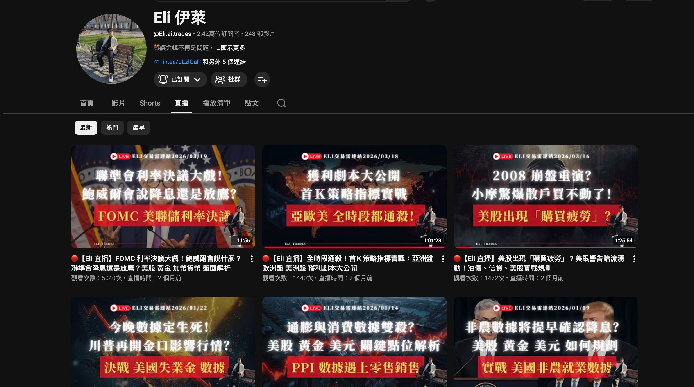
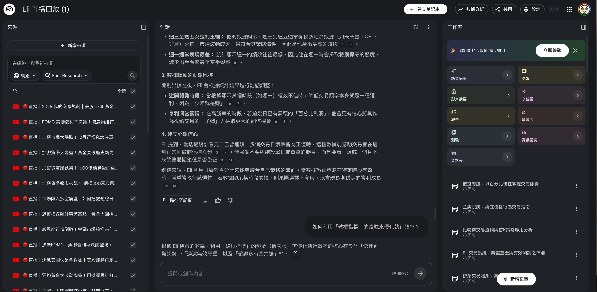
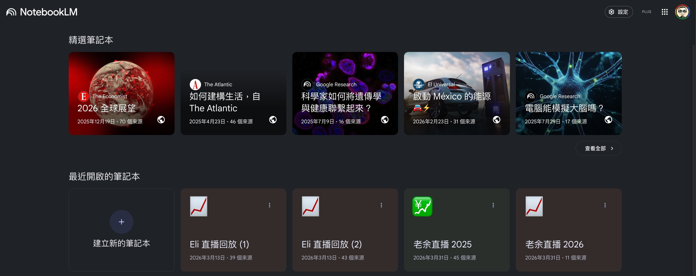
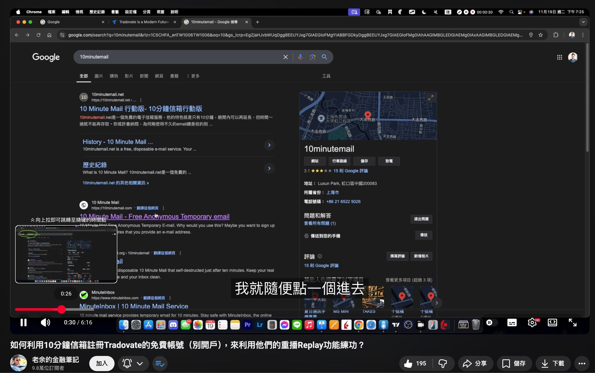

# Trading 專案

這是我把我的兩個交易的老師

- [老余的金融筆記](https://www.youtube.com/@KevinYuFutures)
- [Eli 伊萊](https://www.youtube.com/@Eli.ai.trades)

> 個人專案：用 Claude Code Skills 打造交易學習 + Pine Script 開發的完整工作流。
> 24 個 Skills，涵蓋「知識萃取 → 策略研究 → 指標開發 → 驗證部署」全鏈路。

他們的學習資源與交易策略，寫成指標
最初目標是完全自動化，但受限於 TradingView 的限制，只能做得到半自動化的指標
這邊不會透露 pine script 的程式碼，但會說明我在學習與實作時的思路

---

## AI 時代如何學習

首先，我會闡述我如何思考與使用 AI 輔助我學習，以及我如何把這些流程自動化

我為了要學習我不熟的外匯與期貨交易。

我直覺想到的是用 [NotebookLM](https://notebooklm.google.com/) 把，我購買的教學影片與直撥影片丟到 NotebookLM (簡稱 `NLM`)，然後來提問，快速理解概念

但我這邊遇到的第一個痛點：影片非常的多，我不想一個一個網址複製，然後去 NLM 貼上，這件事應該要自動化才對

### 情境 1: 如何用已有的 AI 與各種 open source 加速學習不熟悉的領域

在 AI 時代，軟體開發會用終端機 (terminal) 跟 Claude Code 協作。

軟體工程師在開發程式時，都會 GitHub 的 open source，像我最熟悉的程式語言 Ruby，與 Ruby On Rails 框架，都是可以看得到程式碼的 open source。 

在沒有 AI 的年代，針對要研究與開發的項目，我們會習慣用 google 去找各種文獻與 open source。

但是現在既然 AI 可以搜尋與閱讀，應該先透過 AI 去研究，然後我們再與 AI 討論各種可能性，然後再決定實作的方向與細節。

在開發時這樣，學習時，也該這樣。

關鍵：我應該 **在 terminal 讓 AI 自己去 github 搜尋，而不是讓 AI 像人一樣打開瀏覽器，去 google 上面搜尋**

所以我會安裝 [Github CLI](https://cli.github.com/) (簡稱 `gh`) 然後，我就可以在 terminal 
1. 叫 Claude Code 透過 `gh` 找到 [notebooklm-mcp-cli](https://github.com/jacob-bd/notebooklm-mcp-cli) 這套工具，來讓我在 terminal 用 cli 跟 NotebookLM 的 api 溝通
2. 接著，我只要直接丟 eli 與 老余 的直撥網址到 terminal，然後 claude Code 就會幫我找到跟 NotebookLM 溝通的工具，把直撥影片丟到 notebookLM

然後我就能在 notebookLM 上面問各種問題，快速理解概念後，再回去看直撥影片，讓我對這些概念的理解更透徹

### 情境 2: 自動化偵測最新直播與同步 NotebookLM

> ['/yt-sync'](/Users/nicholas/Desktop/WG-Portfolio/portfolio/ai-collaboration/experience/trading/skills/yt-sync.md)

前面「把大量地直撥影片丟進 NotebookLM」的問題
- Eli 直播：YouTube 上 81 部
- 老余直播：YouTube 上 323 部

但每次老師開直撥時，我都要開口跟 AI 說同步哪個老師的直撥，這種事情太瑣碎且重複了，也該要自動化才對

我一樣透過 `gh` 讓 Claude Code 找到 [yt-dlp](https://github.com/yt-dlp/yt-dlp) 這個工具。它除了能下載 YouTube 影片，還能抓取一個頻道上所有影片的清單。

有了這個工具後，我設計了 `/yt-sync` skill，他依序執行
1. `yt-dlp` 抓頻道清單、比對差集
2. `NLM MCP` 的 `source_add` 把新直播加進 NLM
3. `NLM MCP` 的 `notebook_query` 直接問「新直播跟舊的有什麼不同」→ 產出 markdown file 差異分析報告

如此一來，我之後只要在 Claude Code 下 `/yt-sync`

就能快速知道，這次的直播內容，有什麼我不知道的洞見與觀點。

### 情境 3: 快速定位影片的幾分幾秒

> ['/vck'](skills/vck.md) + ['/transcribe'](skills/transcribe.md)

但是還有個問題，我只是在 NLM 上面討論，我還是需要回頭看老師的影片才能真正吸收

但我遇到一個問題：**我要如何定位出直撥影片的幾分幾秒，是我要看的內容**

比如我想複習老余的「破底翻」這個概念，我知道好幾部直播都有講過，但具體是 **哪部影片的幾時幾分幾秒？**

後來，我想到一個方式，我可以透過 yt-dlp 取得音訊，然後找找看有沒有什麼 open source 可以處理音訊轉字幕，這樣我就能取得 srt 字幕檔來快速定位影片的幾分幾秒，是我需要的資訊了

於是我又讓 Claude Code 用 `gh` 找到了 [mlx_whisper](https://github.com/ml-explore/mlx-examples)，這是一個在 Apple 晶片上跑的語音轉文字工具，速度很快。搭配前面的 [yt-dlp](https://github.com/yt-dlp/yt-dlp)，我設計了 `/transcribe` 和 `/vck` 兩個 skill，依序執行

1. `yt-dlp` 只下載音訊（不下載影片，省空間）
2. `mlx_whisper` 把音訊轉成帶時間戳記的逐字稿
3. `/vck` 用關鍵字搜尋所有逐字稿 → 定位到「哪部影片的幾分幾秒在講這個概念」

轉完之後，數百部影片就變成了數百份可以搜尋的文字檔。我只要輸入關鍵字，就能找到「哪部直撥影片(網址是什麼)的 32 分 17 秒到 35 分 00 秒在講破底翻」，然後直接跳到那個時間點去看。

## 情境 4: 如何在模擬倉練習交易

看了兩位老師的直撥與付費課程的影片後，我需要實際投入練習，在模擬倉練習交易

在此我以老余的策略，註冊 trialdovate練習期貨為例
- [如何利用10分鐘信箱註冊Tradovate的免費帳號（別開戶），來利用他們的重播Replay功能練功？](https://www.youtube.com/watch?v=X3wFnVA-SoE)

老余原始的做法，是 google 找 10分鐘信箱來註冊 Tradovate trial account

但是，依照我們用 AI 的方式會直覺覺得，這樣太慢了，我根本就不該 google 去找 10 min mail 的服務，也不該去網頁上面操作 10 minute mail 服務，以及在 Tradovate 的頁面手動註冊

所以我該做到兩件事
1. 找到 claude code 可以直接用 api 溝通的暫時性的 mail 服務
2. 找出 Tradovate 背後註冊 trial 的 api 

然後把他包成 script ，然後包成 skill，之後 skill 就能自動化，我完全不用在這重複的工作動腦

### 情境 4-0: 找出可以讓 AI 用 API 操作的 mail 服務

於是我讓 Claude Code 用 `gh` 搜尋，找到了 [mail.tm](https://mail.tm) — 免費、有 REST API、不需要金鑰，信箱是閒置約 7 天才會被清掉，不是倒數消失。

不過這邊有個風險：很多正規服務會封鎖已知的拋棄式信箱網域。Tradovate 會不會擋 mail.tm？這只能實測才知道。

結果：**沒被擋**，驗證信約 78 秒後送達。第一關過了。

我把跟 mail.tm 溝通的邏輯包成了 [`mailtm.sh`](scripts/mailtm.sh)，它可以建信箱、輪詢收件匣、讀出驗證連結，全程純 API，不需要開瀏覽器。

### 情境 4-1: 如何找出 Tradovate 背後用的 API

> ['/sniff'](scripts/capture.mjs)

有了 **mail.tm** 之後，第二個問題是：Tradovate 的註冊頁面，點下「Sign Up」按鈕後，背後到底打了哪個 API？

如果我能找到那個 API，就能直接用程式呼叫它，完全不需要開瀏覽器去填表單。

但我不想只是這次手動打開 Chrome DevTools 看一看就算了。以後遇到別的網站也會有同樣的需求，所以我想把「逆向分析網頁背後的 API」這件事本身也做成一個可重複使用的工具。

於是我讓 Claude Code 用 `gh` 找到了 [puppeteer-core](https://github.com/nicktomlin/nicktomlin/)，它可以用程式開一個獨立的 Chrome 視窗，錄下所有的 network request。我把它包成 [`capture.mjs`](scripts/capture.mjs)，流程很簡單：

1. 開一個獨立的 Chrome 視窗（不會影響我日常在用的瀏覽器）
2. 我在那個視窗裡操作目標網站（填表單、點按鈕）
3. 關掉視窗，程式自動把所有錄到的 request 存成 JSON

拿 Tradovate 來實測：操作一次註冊流程，錄下了 112 筆 request，其中 37 個 POST。分析後發現，36 個都是 Google Analytics、Bugsnag 之類的埋點，**真正的業務 API 只有 1 個**。

第二次 sniff 建帳號的頁面，又找到了完成註冊的 API。

最關鍵的發現：這兩個 API **零 captcha、零 cookie**，意味著可以用最簡單的方式（curl）直接呼叫，完全不需要瀏覽器。

### 情境 4-2: 自動化建立 Tradovate trial account 讓我在模擬倉練習交易

> [`tradovate-new.sh`](scripts/tradovate-new.sh) + [`tradovate-signup.sh`](scripts/tradovate-signup.sh)
> ⚠️ 腳本中的 API 路徑已去識別化，避免在公開平台透露第三方服務的內部 API path

有了 mail.tm 能讓程式收信，又有了 `/sniff` 找出來的兩個 API，接下來就是把它們串起來。

就能讓 Claude Code 把整個流程包成 [`tradovate-new.sh`](scripts/tradovate-new.sh)，它依序執行四步：

1. 用 [`mailtm.sh`](scripts/mailtm.sh) 建一個拋棄式信箱
2. 呼叫第一個 API，觸發 Tradovate 寄驗證信到這個信箱
3. 用 `mailtm.sh` 輪詢收件匣，等驗證信進來，抓出裡面的驗證連結
4. 呼叫第二個 API，帶上驗證連結裡的 token，完成註冊

整個過程 10 到 30 秒，全程零瀏覽器。跑完後 stdout 直接印出帳號密碼，同時自動寫入一份台帳（TSV 檔），方便管理哪些帳號還在用、哪些已經過期。

以後每次 trial 到期，我只要在 Claude Code 下一個指令，就有新帳號可以繼續練習。

## 開發在 TraidingView 運行的 pine script 程式寫交易指標

### 情境 1: 如何取得 TradingView 的 K 棒資料

> ['/chart-archive'](skills/chart-archive.md) + [`chart-archive.mjs`](scripts/chart-archive.mjs)

我要開發的交易指標是用 Pine Script 寫的，它跑在 TradingView 這個網頁平台的沙盒裡。Claude Code 完全看不到 TradingView 上面的 K 線圖，也摸不到裡面的資料。

這代表一件事：我改了指標邏輯之後，沒辦法用程式驗證結果對不對，只能用眼睛看圖表。這在複雜的指標開發中很容易漏掉問題。

所以第一步，我需要把 K 線資料從 TradingView 拉出來，讓 Claude Code 也能看到同樣的數據。

但 TradingView 沒有公開的 K 線資料 API。不過我想，瀏覽器打開 TradingView 時，背後一定有在打某個 API 取資料。如果我能找到那個 API，程式就能撈同樣的東西。

於是我讓 Claude Code 用 `gh` 搜尋，找到了 [TradingView-API](https://github.com/Mathieu2301/TradingView-API) 這個 open source，它可以透過 WebSocket 拉 K 線的 OHLCV 資料（開盤、最高、最低、收盤、成交量）。

不過這邊遇到兩個問題：

第一個，TradingView 需要登入才能取資料。我又讓 Claude Code 用 `gh` 找到了 [rookiepy](https://github.com/borisbabic/browser_cookie3)，它可以從 Chrome 解密出 TradingView 的登入 cookie。我把它包成一套共用的快取機制 — cookie 存在一個 JSON 檔裡，7 天過期後自動更新，所有工具共用同一份。

第二個，TradingView 的短週期 K 線只保留有限天數（1 分鐘的大約只有 30 天）。如果不定期撈，過了就沒了。所以我設計了增量歸檔的機制：記錄每個時間週期最後一根 K 線的時間，下次只撈那之後的新資料，不重撈舊的。

最後包成了 `/chart-archive` skill 和 [`chart-archive.mjs`](scripts/chart-archive.mjs)，支援 7 個時間週期（從 1 分鐘到週線），每天跑一次就能把最新的 K 線歸檔到本地。

### 情境 2: 如何讓 Claude Code 理解我在 TradingView 上面畫的圖

### 情境 3: 如何從零實作出 eli 的首Ｋ策略的指標，與破框策略的指標

### 情境 4:
