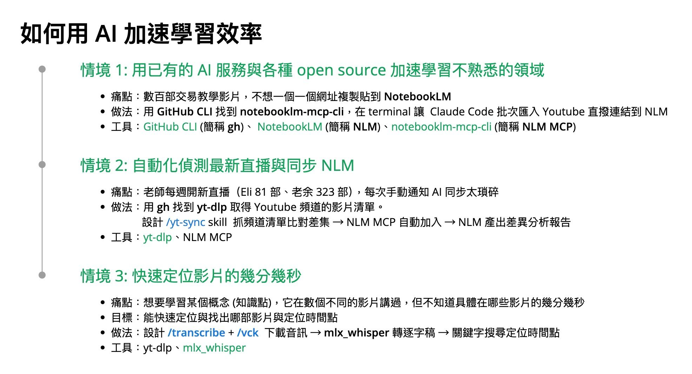

# Shifu 平台如何使用 AI 讓學生學習更有效率

依據徵才條件，附上三篇我寫過的公開文章
1. [如何打造一天內收到五家面試的履歷，甚至讓面試的老闆寫文章稱讚？ - INSIDE](https://www.inside.com.tw/article/8476-resume)
2. [已經超過 70 人獲得 Medium 作家鋼鐵V 當面傳授個人品牌經營心法，你還不快上車？ | by NickWarm | Medium](https://medium.com/%E7%AD%96%E7%95%A5%E5%85%88%E6%B1%BA/%E5%B7%B2%E7%B6%93%E8%B6%85%E9%81%8E-70-%E4%BA%BA%E7%8D%B2%E5%BE%97-medium-%E4%BD%9C%E5%AE%B6%E9%8B%BC%E9%90%B5v-%E7%95%B6%E9%9D%A2%E5%82%B3%E6%8E%88%E5%80%8B%E4%BA%BA%E5%93%81%E7%89%8C%E7%B6%93%E7%87%9F%E5%BF%83%E6%B3%95-%E4%BD%A0%E9%82%84%E4%B8%8D%E5%BF%AB%E4%B8%8A%E8%BB%8A-5fd030dee2c8)
3. [人物側寫：桌遊菜鳥的窄市場 | by NickWarm | Medium](https://medium.com/%E7%AD%96%E7%95%A5%E5%85%88%E6%B1%BA/%E4%BA%BA%E7%89%A9%E5%81%B4%E5%AF%AB-%E6%A1%8C%E9%81%8A%E8%8F%9C%E9%B3%A5%E7%9A%84%E7%AA%84%E5%B8%82%E5%A0%B4-e941b3285656)

但我覺得，我在與 AI 協作自學外匯與期貨交易，這個陌生領域的知識後，我該寫篇如何用 AI 在大師平台加速學習效率，透過求職時給大師平台。

這也是表達我的感謝，畢竟我已經在陳修平的師父商學院 podcast 獲得不少收穫。

## 讓學生帶著問題前來跟師父請益

線上課程，是老師單向跟學生授課，因為老師也不是在自己面前，所以無法及時跟老師互動，心中的疑惑也無法透過向老師提問，獲得即時反饋。

如果學生當下又有其他忙碌的項目，很容易買了課程，就沒安排時間學習。

那麼，只要換個方式，讓學生在上課 (看課程影片前)，先能快速理解大綱，視覺看到一些關鍵字，然後心中產生疑惑，與 AI 做些討論與初步的理解後。

學生帶著問題在大師平台看影片學習，就能更能快速學會該領域的知識。

這整套流程，就是 NotebookLM 在做的事，也是我為何會在履歷的作品集最先提到我如何透過 NotebookLM 學習。

學生只要
1. 把音訊抽出來然後丟到 NotebookLM 
2. 開始問各種問題，讓 NotebookLM 回答
3. 與 NotebooLM 討論的內容，可以存成筆記下載到自己的電腦

這個功能，師傅平台完全可以自己做起來才對

因為抽出音訊這件事，最簡單的就是桌面錄影，這種完全無法防。

與其去防，不如像教 [Word, PPT 的台科大林孟彥教授](https://www.youtube.com/watch?v=1n2wrfktKAk)一樣，一開始就把投影片無償準備給學生

大師平台可以請軟體工程師打通這些環節，讓購買同個課程的學生，都可以問同一個 NotebookLM 問題，

讓學生心中帶著問題來看老師在大師平台的課程影片，這樣完課與學習效率會提高。

這就像是已經有工作經驗，知道自己該問什麼問題，所以回頭去上 EMBA 一樣。這樣會有更高的學習效率。

如果要再更進一步改進，可以做我的作品集提到的：自動定位出相關問題，是哪個影片幾分幾秒

1. 用 `mlx_whisper` 把音訊轉成帶時間戳記的逐字稿
2. 用關鍵字搜尋所有逐字稿 → 定位到「哪部影片的幾分幾秒在講這個概念」

## 如何找出工作中可以自動化的環節

對我來說，自動化這件事，其實是非常「駭客精神」的一件事

就像 NotebookLM 的使用方式，開發 NotebookLM 的工程師會針對使用情境與使用介面去設計，但是有駭客精神的人，會想著如何用不操作 NotebookLM UI 介面的方式，取得我想要的筆記或是寫入我想要的學習的內容到 NotebookLM。

而我在 Tradovate 註冊 trial account 這件事，去破解出 Tradovate 背後的註冊 trial 用的 api，以及完全不操作任何 10 分鐘 mail 來做註冊，讓 claude code 用 skill 與 script 幫我完成，也是相同的概念

每間公司，需要自動化的痛點又都不同，做自動化這份工作的軟體工程師，應該要很有興趣公司裡所有職位的工作項目。

實際去投入工程師以外的工作，去反思哪邊可以自動化，然後再用駭客的思考方式，去找出程式與 AI 可以自動化的地方。

